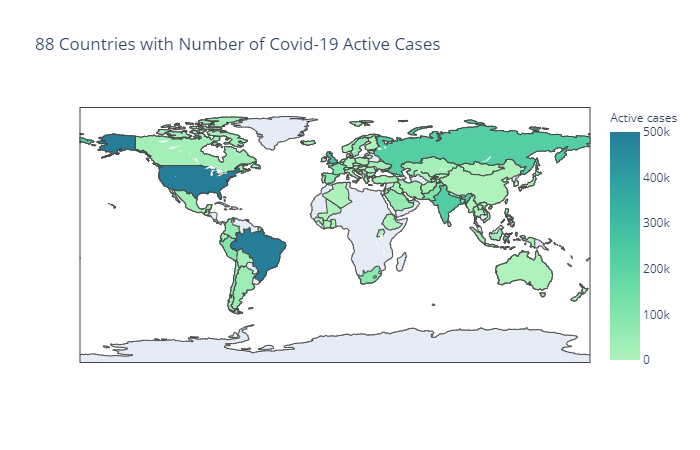

# Project 1 - Monash Data Analytics Bootcamp

## Background

The year 2020 will no doubt go down in history. With the coronavirus COVID-19 spreading out all over the world, life, as we know, has come to a grinding halt with lockdowns and social distancing rules. But can something good come out of it? For example, has the world air quality improved after half a year into the pandemic?

Now, we know what you may be thinking. With so many people stuck at home, less traffic, and fewer production activities, the air quality would get better.

But how would you **prove** it?

## What is this project is about?

To understand the impact of Covid-19 on air quality, we use world air quality data and COVID-19 data from different sources.
We've zoomed in two countries Australia and India to visualise their air quality change from 2019 to 2020H1.

* We've chosen Australia because it is so close to our hearts. In Australia, we chose Melbourne, Sydney and Perth to visualise how some of the main air pollutants have changed from 2019 to now. Melbourne and Sydney are the two most populous cities in Australia, and Perth is home to one of our team members.

* For our choice of India, our objective is to compare Australia with another country with a vastly different environmental context. [India is one of the most polluted countries in the world](https://worldpopulationreview.com/country-rankings/most-polluted-countries). For India, we chose to visualise three of its most populous cities: Mumbai, Delhi, Hyderabad.

* Then we've used linear regression models to see if the change in Covid-19 active cases has any correlation with the variability in the major air pollutants in Australian, India and the world in the first 6 months of 2020. By saying the world, we mean the 88 countries that are in both the air quality data and Covid-19 data in 2020H1. The below map highlights what countries covered in our analysis.

## Where did the data come from?

1. The air quality data: https://aqicn.org/data-platform/covid19/

    The air quality data is provided by the World Air Quality Index project team. The data for each major city is measured at several stations. The dataset provides min, max, median and standard deviation for each of the air pollutant species (PM2.5, PM10, Ozone, etc.) as well as meteorological data (Wind, Temperature, etc.). All air pollutants are converted to the US EPA standard. All dates are UTC based. The count column is the number of samples used for calculating the summary statistics. 
    
    Following are details on when the air quality data was generated to the csv files:
    
    * Data-Set 2020 Generated on 2020-07-03T09:04:30+01:00
    * Data-Set 2019Q4 Generated on 2020-04-13T01:05:30+01:00
    * Data-Set 2019Q3 Generated on 2020-04-13T01:05:11+01:00
    * Data-Set 2019Q2 Generated on 2020-04-13T01:04:56+01:00
    * Data-Set 2019Q1 Generated on 2020-04-13T01:04:43+01:00
    
2. The Covid-19 world data: https://covid19api.com/

    The two APIs that we've used:
    
    * https://api.covid19api.com/countries: To get the country name, country code and slug. The country code is used to merge with the air quality data (with country code only). The slug is later used to loop through the Covid-19 API by all case status for each slug (each country).
    
    * https://api.covid19api.com/total/country/slug: Covid-19 API by all case status for each country
    
## Where can I see the notebook?

1. [Data exploration and clean up](https://github.com/poojaisabelle/Project-One/blob/master/data_exploration_cleanup_MASTER.ipynb)

2. [Final analysis](https://github.com/poojaisabelle/Project-One/blob/master/final_analysis_MASTER.ipynb)
    
## Limitations:

1. We've only focused on the five major pollutants:

    * Ground-level ozone **o3** (ppm - parts per million)
    * Particulate Matter - including PM2.5 **pm25** and PM10 **pm10** (μg/m3)
    * Carbon Monoxide **co** (ppm)
    * Sulfur Dioxide **so2** (ppb - parts per billion)
    * Nitrogen Dioxide **no2** (ppb)
   
   The above major pollutants are the components of the Air Quality Index (AQI), which is regulated by the Clean Air Act.
   
There are other parameters that affect air quality.

2. Understanding about the units of the air pollutants
The units of the air pollutants are not explicitly stated inside the air quality data. We've interpreted their units as instructed [here](https://www.airnow.gov/sites/default/files/2020-05/aqi-technical-assistance-document-sept2018.pdf). We do not guarantee that's exactly what the units should be.

3. From observing the distribution of the median value of the air pollutants, we've seen that there are quite a few extreme values in the median measurements of the 6 air pollutants (pm2.5, no2, pm10, o3, so2 and co). However, due to our time and especially knowledge limitation on air pollution, we have not removed any extreme values. We'd like to draw attention from anyone with the domain knowledge to this issue. Any should-be-removed outliers would have some impact on our analysis.

4. Though we've used a linear regression model to understand the correlation between variation in Covid-19 active cases with the change in the level of different air pollutant, we understand there might be a better model for that.

5. The study is restricted to 88 countries that are in both the air quality data and Covid-19 data up until 1 July 2020.

## TODO:

1. With more resources, we would investigate further any potential outliers in the data.

2. We could explore and visualise the air quality data for more cities/countries/parameters under a longer/different timeframes.

3. We could try out other statistical models to understand more about the correlation between Covid-19 and Air Quality.

4. We would analyse the air quality data via more parameters and Covid-19 data via more case status (instead of just Active cases). 

---
We make no claims as the ownership of the data. Hence, please do what you'd love with the data but credit the appropriate people.